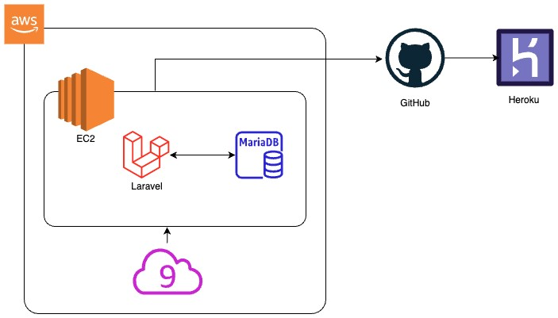

Enjoy　Fuji🗻

このアプリでは、富士山登山に関する知識を得たり、富士山の写真を投稿したり、富士山に関する質問などをして富士山をみんなで楽しむアプリです。

## 機能

<ul>
    <li>富士山の概要やマナー、コースの説明閲覧</li>
    <li>富士山に関する写真やコメントを投稿</li>
    <li>富士山に関するQ&A</li>
    <li>富士山の天気予報</li>
</ul>

## APP URL

<a href="https://fujisan-270b5f16309e.herokuapp.com/">https://fujisan-270b5f16309e.herokuapp.com/</a>

## 使用技術
<ul>
    <li>バックエンド</li>
        <ul>
            <li>laravel</li>
                <ul>
                    <li>標準(MVCモデル)</li>
                    <li>Breeze</li>
                </ul>
        </ul>
    <li>フロントエンド</li>
        <ul>
            <li>HTML</li>
            <li>SCSS</li>
            <li>JavaScript</li>
            <li>TailwindCSS</li>
            <li>Flowrift</li>
        </ul>
    <li>インフラストラクチャー</li>
        <ul>
            <li>AWS</li>
                <ul>
                    <li>MariaDB</li>
                </ul>
        </ul>
    <li>IDE</li>
        <ul>
            <li>AWS</li>
                <ul>
                    <li>Cloud9</li>
                </ul>
        </ul>
    <li>バージョン管理・CL/CD</li>
        <ul>
            <li>GitHub</li>
            <li>Heroku</li>
        </ul>
</ul>

## ER図

## AWS図

## 操作画面
[操作方法]("public/images/operation_document")
